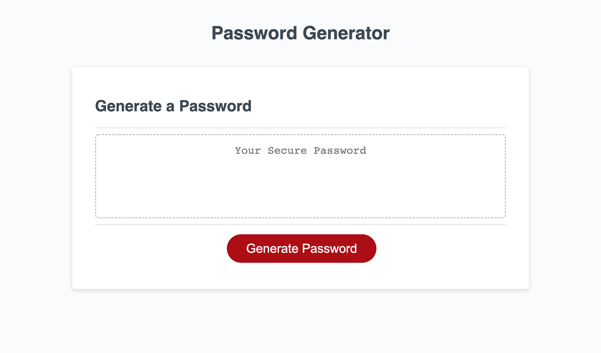

# Password Generator Starter Code

## Random Password Generator

In this project, we were tasked with creating a random password generator using only JavaScript. The user is invited to click on the "generate password" button, and is prompted with a series of questions--how long would they like their password to be? Would they like to use lower, or uppercase letters? Numbers? What about special characters? When clicking "OK" to confirm or "CANCEL" to deny, JavaScript takes in that information and generates a password based on this criteria.

In my project, I first prompted the user to fill out their desired password by using "if" statements, or conditional statements. If the user clicked "OK," the variables for each criterion would concatenate onto the variable declared "string," which I just set as an empty string. After the user finishes filling out their desired criteria, they are alerted with a message that shows them their randomly generated password.

The function generatePassword() executes a "for" loop, where the initial "if" statement keeps the "for" loop running for however many times the user has selected. Math.floor(Math.random() * string.length) randomly generates a number and determines the character that is chosen next in the loop. It runs however many times it needs to for the password to be generated--if the user wants a 37-character long password, the loop runs 37 times. "string" has the concatenated variables for the numbers, characters, and upper and lower cases, and makes them one long array all together. This string is what's executed in the "for" loop. "string[randString]" returns the value of the array at the given index, and adds them together into the variable randPassword. randPassword is what's returned at the end of the "for" loop, and is the variable created in the function generatePassword().

## Screenshot

A screenshot of the project: 

## Links

Link to the deployed website: https://mtpott.github.io/megan-random-pass-challenge/

Link to the corresponding GitHub repository: https://github.com/mtpott/megan-random-pass-challenge